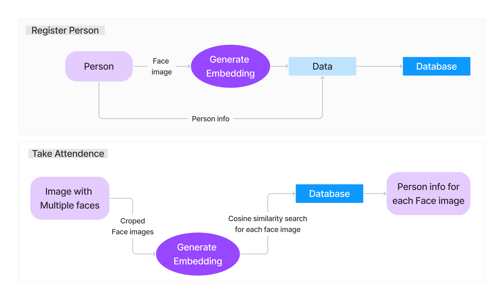

# Attendance System using Face Recognition

This project is an attendance management system that leverages facial recognition technology for accurate and automated attendance tracking. The system uses vector search techniques, specifically cosine similarity, to identify individuals based on their facial embeddings.

## Features

- **Face Registration**: Capture a face image to create a unique embedding and store it in the database.
- **Automated Attendance**: Detect multiple faces in an image, generate embeddings, and use cosine similarity search to match each face with registered individuals.
- **Database Management**: Stores facial embeddings and associated user information in a database for efficient retrieval and matching.
  
## Requirements

- **Python Version**: Python 3.11
- **Libraries**: Ensure you have the following libraries installed:
  - `tensorflow 2+` for facial recognition and embedding generation
  - `pymongo` for databse operation such as store person info and embedding and cosine similarity search of image 
  - `OpenCV` for image processing
  - `streamlit` for frontend

## Architecture Overview

The architecture of the project is shown below:

### 1. **Register Person**:
   - The face of each person is captured and an embedding (numerical vector) is generated using MobileNet model.
   - This embedding, along with the person's information, is stored in the database.

### 2. **Take Attendance**:
   - An image containing multiple faces is processed by cropping each detected face.
   - Each face is converted into an embedding, and a cosine similarity search is performed against the stored embeddings in the database.
   - Based on the similarity results, the system identifies each individual and show their attendance.



## Video Demonstration

Click on below image to redirect to youtube vedio:

[](https://youtu.be/hhsgVJLCsDw)


## Installation

```
pip install -r requirements.txt
```

```
streamlit run view_attendance.py
```
